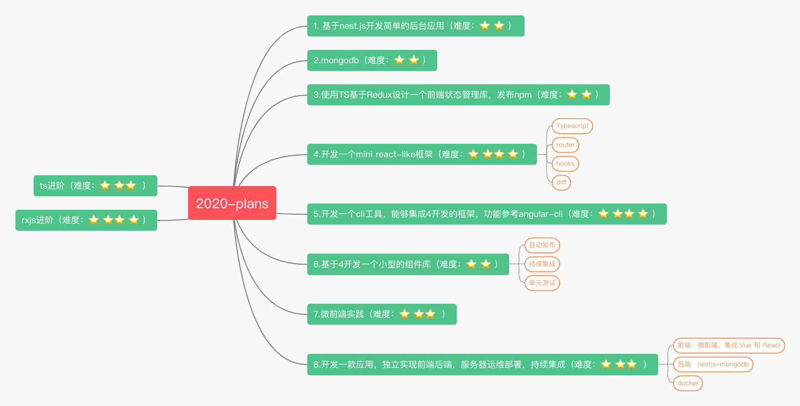

# 2020-plans

## 流程
1. 先确定学习主题
2. 寻找好的学习资源（入门最好看视频),发布在`master`分支
3. 基于`dev`切分支，分支名为 `名字+‘-’+学习主题`
4. 完成后，如果有总结文章分享，切换到`master分支`在对应的目录下编写markdown文章

## Doing
- nestjs学习（20202-28 至 ）
- Redux优化方案发布npm包

## Done
- nestjs学习
  - 总结文章
  - 项目代码地址 

## 2020-plans

## 

